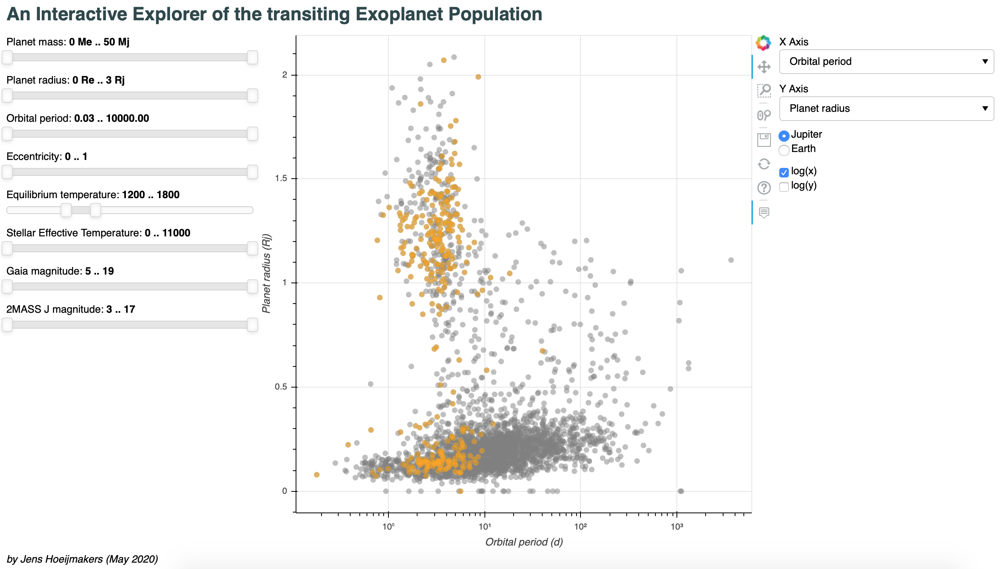

# Exoplanet_population
Plotting the transiting exoplanet population with selection criteria, using Astroquery and Bokeh.

This is a script that reads the NASA exoplanet archive using Astroquery, and sets up an interactive Bokeh app to display the population of transiting exoplanets along various axes. The app allows the user to interactively highlight parts of the population based on various selection criteria (see below).

**To get started:**
1. Make sure you have Bokeh installed (<https://bokeh.org>), as well as astropy (<https://www.astropy.org>) and numpy.
2. Download the repository to a local folder,e.g. `/home/user/plot_population`)
3. From a terminal, run `bokeh serve --show /home/user/plot_population` to start the Bokeh app in your default browser.
